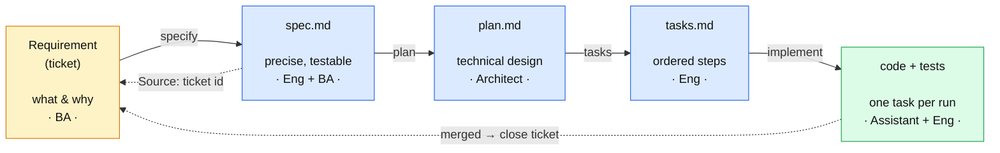
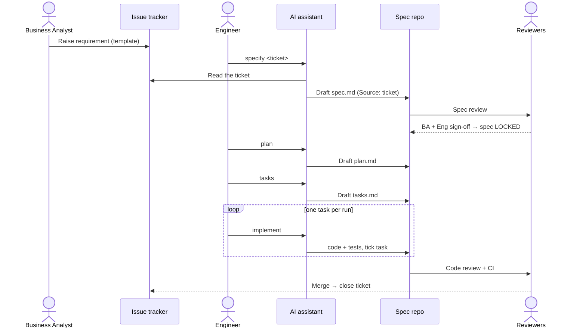

# Spec-Driven Development — Engineering Guidelines

> Our standard for building software with an AI coding assistant. It describes **how** we go
> from a business requirement to merged code, **why** each step exists, **who owns** it, and
> **what it costs** in the assistant's context window.
>
> These guidelines are deliberately **tool- and language-agnostic**. The core ideas hold
> whatever assistant, language, or framework a team uses. Where we name a specific tool, it is
> in an *“In our setup”* callout that you can change without changing the method.

---

## Contents
1. [Overview & purpose](#1-overview--purpose)
2. [Principles](#2-principles)
3. [Roles & ownership](#3-roles--ownership)
4. [The workflow](#4-the-workflow)
5. [Why the ticket is not the spec](#5-why-the-ticket-is-not-the-spec)
6. [Artifacts & repository layout](#6-artifacts--repository-layout)
7. [The assistant config (`.github`) structure and why](#7-the-assistant-config-github-structure-and-why)
8. [Context & cost model](#8-context--cost-model)
9. [Quality gates & Definition of Done](#9-quality-gates--definition-of-done)
10. [Governance, audit & compliance](#10-governance-audit--compliance)
11. [Adoption checklist](#11-adoption-checklist)
12. [FAQ](#12-faq)
13. [Glossary](#13-glossary)

---

## 1. Overview & purpose

**Spec-Driven Development (SDD)** means we write a precise, reviewed **specification** before an
AI assistant writes code, and we treat that specification — not the original ticket, not a chat
prompt — as the source of truth the code is built against.

**The problem it solves.** An AI assistant is only as good as the context it is given. A vague
ticket (“let agents check if a payment can be refunded”) forces the assistant to *guess* the
missing detail — limits, states, error handling, edge cases — and guesses are where defects and
hallucinations come from. SDD removes the guessing by making the requirement **exact and testable
before** any code is generated.

**What good looks like.**
- Every change traces from a business requirement → a reviewed spec → a plan → code → a merge.
- The assistant works from small, precise, version-controlled artifacts, not from memory or chat.
- A reviewer can answer “why is the code like this?” by reading the spec, not by interrogating the
  author.

**When to apply it.** Any change with real behaviour or risk. A one-line typo fix does not need a
spec; a new endpoint, a rule change, or anything customer- or money-facing does.

> **In our setup:** the AI assistant is **GitHub Copilot**, requirements live in **GitLab** issues
> with a `CRSU-####` key, and the assistant can read those issues via a **GitLab MCP** server.

---

## 2. Principles

Five ideas everything else follows from. Each has a one-line reason.

1. **The spec is the source of truth — not the ticket, not the chat.**
   *Why:* code must be built against something precise, reviewed, and version-pinned. (See §5.)
2. **Small, individually-verifiable steps.**
   *Why:* small diffs are reviewable, cheaper for the assistant to produce, and less prone to
   hallucination than “build the whole thing at once”.
3. **A human gate at every transition.**
   *Why:* the assistant accelerates work; it does not get to approve its own requirements, design,
   or merges. Accountability stays with people.
4. **End-to-end traceability.**
   *Why:* in a regulated environment we must be able to walk requirement → spec → code → merge in
   both directions, and prove what was built and why.
5. **Lean always-on context.**
   *Why:* anything the assistant reads on *every* request is paid for on every request, by every
   developer. Keep the always-on context small and load detail only when needed. (See §8.)

---

## 3. Roles & ownership

One table so “who owns this step?” has a single authoritative answer. **A** = Accountable
(one per step), **R** = Responsible (does the work), **C** = Consulted, **I** = Informed.

| Step | Business Analyst | Engineer | Tech Lead / Architect | AI Assistant | Reviewers (peers) | Risk / Compliance |
|---|---|---|---|---|---|---|
| Requirement | **A/R** | C | I | – | – | C |
| Specify (spec) | **C/approve** | **R** | A | assists | C | C (policy values) |
| Plan | I | R | **A/R** | assists | C | I |
| Tasks | I | **A/R** | C | assists | I | – |
| Implement | I | **A** | – | **R** | **R** (review) | – |
| Merge & close | I | A | C | – | **R** | I |

Key point: the **AI assistant is never Accountable**. It is Responsible for producing drafts and
code under a human who is Accountable for the result.

---

## 4. The workflow

Five stages, each described with the **same template** so you always find the owner, the rationale,
the optionality, and the cost in the same place.

### Pipeline



### Handoffs & review gates



### The per-stage template

Each stage below uses these fields: **Purpose · Why it exists · Owner · Inputs · Output ·
Quality gate · Optional? · Prompt cost.**

---

### Stage 0 — Requirement
- **Purpose:** capture the business need as a tracked ticket.
- **Why it exists:** gives every change a single referenceable origin and an audit anchor, and
  separates the *what/why* (business) from the *how* (engineering).
- **Owner:** Business Analyst.
- **Inputs:** a business need.
- **Output:** a ticket written at **business altitude** — goal, functional and non-functional
  needs, acceptance criteria — using the requirement template. The BA is **not** expected to know
  the code.
- **Quality gate:** triaged, labelled, and has at least a goal and acceptance criteria.
- **Optional?** No. Every change traces to a ticket.
- **Prompt cost:** none yet (no AI). Keep the ticket **structured** so later ingestion is cheap.

### Stage 1 — Specify → `spec.md`
- **Purpose:** turn the vague ticket into a **precise, testable** specification.
- **Why it exists:** the gap between business intent and code must be filled with engineering
  knowledge (architecture, domain rules, error model). *Filling that gap is the spec.* Point the
  assistant at the raw ticket instead and it fills the gap by guessing.
- **Owner:** Engineer (Responsible), Tech Lead (Accountable), BA (approves intent).
- **Inputs:** the ticket **plus** project context — principles, architecture notes, domain glossary.
- **Output:** `spec.md` with a `Source: <ticket-id>` header, requirements in **EARS** form,
  concrete NFRs, and **Gherkin** acceptance criteria (which become the tests).
- **Quality gate:** spec review. **BA signs off** “captures intent”; **engineering signs off**
  “precise and testable”. The spec is then **locked**.
- **Optional?** No — this is the heart of SDD.
- **Prompt cost:** *medium.* This stage reads the ticket (once) and the project context. Pull the
  ticket here, distil it, and commit the result so later stages never re-read the noisy ticket.

### Stage 2 — Plan → `plan.md`
- **Purpose:** the technical design derived from the locked spec.
- **Why it exists:** separates *design decisions* from *mechanical coding*, and creates a review
  point **before** code exists. Records contestable choices as short decision notes (ADRs).
- **Owner:** Tech Lead / Architect.
- **Inputs:** the locked `spec.md` + architecture context.
- **Output:** `plan.md` (components, data model, decisions, risks) and any interface contracts.
- **Quality gate:** design review. No code yet.
- **Optional?** Can be **folded into the spec** for a very small change — but the *decisions* must
  be recorded somewhere reviewable.
- **Prompt cost:** *medium.* Reads the spec + architecture. It does **not** need the raw ticket —
  that is the payoff of having distilled it in Stage 1.

### Stage 3 — Tasks → `tasks.md`
- **Purpose:** break the plan into small, ordered, individually verifiable steps.
- **Why it exists:** this is the **control surface for the assistant**. One task per run yields
  small, reviewable diffs, lower per-run context cost, and fewer hallucinations than asking it to
  build the whole plan. It also turns acceptance criteria into a coverage checklist.
- **Owner:** Engineer.
- **Inputs:** `plan.md`.
- **Output:** `tasks.md` — an ordered checklist; each task names the files it touches and how it is
  verified.
- **Quality gate:** every acceptance criterion in the spec maps to at least one task.
- **Optional?** **Yes, for trivial changes** — fold the task list into the end of `plan.md`. What
  you must **never** drop is the *principle* of small, individually-verified steps.
- **Prompt cost:** *low.* Reads the plan only.

### Stage 4 — Implement → code + tests
- **Purpose:** produce working, tested code.
- **Why it exists:** turning a verified task list into code is the part the assistant does best —
  **one task per run** keeps each diff small and reviewable.
- **Owner:** AI assistant (Responsible) under an Engineer (Accountable).
- **Inputs:** `tasks.md` + the relevant code + the scoped coding rules (see §7).
- **Output:** code and tests; each completed task is ticked off.
- **Quality gate:** code review + CI green. Then **close the ticket**.
- **Optional?** No.
- **Prompt cost:** *lowest per run by design.* Attach only `tasks.md` and the files in play — **not**
  the whole spec history. This is the single biggest cost lever in the whole flow.

---

## 5. Why the ticket is not the spec

A recurring question: *if the assistant can read the ticket, why write a separate spec?* Because
the ticket is the **origin of intent**, not the **build contract**. We distil it into a committed
`spec.md` and build from that, for these reasons:

1. **Audience & altitude.** The BA writes business intent and is not versed in the code. The
   assistant needs code-aware precision. Closing that gap *is* the spec; skip it and the gap is
   closed by guessing.
2. **Immutability & reproducibility.** Tickets mutate — descriptions get edited, comments pile up.
   Code must be built against a **frozen, version-pinned** input. A commit proves exactly what the
   code was built from; a live ticket does not.
3. **A review/approval gate.** A ticket thread is discussion, not an approved contract. The spec
   gets an explicit dual sign-off (BA: “captures intent”, Eng: “precise & testable”).
4. **Audit & traceability.** A committed spec carrying `Source: <ticket>` gives two-way
   traceability that an auditor can walk. “The assistant read the ticket once” is not auditable.
5. **Context cost & signal.** A ticket payload is noisy (labels, metadata, dozens of comments).
   A curated spec is lean signal the assistant reads cheaply and repeatably. (See §8.)
6. **Downstream determinism.** Plan and tasks derive from the spec. If they derive from a live,
   editable ticket, an edit mid-sprint silently desyncs the plan, tasks, and code from what was
   reviewed.
7. **Tool independence.** The spec lives with the code and survives a tracker migration, a project
   re-key, or the ticket being archived.

> **“But our assistant can fetch the ticket automatically.”** That changes the *mechanism*, not the
> conclusion. Automatic fetch replaces the copy-paste into the spec step — it does **not** give you
> immutability, a review gate, audit traceability, or low-noise context. So we use the fetch to
> *feed* the spec step, and still **commit the spec** as the reviewed source of truth.

**One line:** *the ticket captures what the business wants; the spec is the engineering-grade,
reviewed, version-pinned contract the assistant and the build actually run against.*

---

## 6. Artifacts & repository layout

Specs live **with the code**, one folder per requirement:

```
specs/
└── <TICKET-KEY>-<short-slug>/
    ├── spec.md          # WHAT & WHY — requirements, NFRs, acceptance criteria. No code.
    ├── plan.md          # HOW — design, decisions, risks.
    ├── tasks.md         # STEPS — ordered, verifiable checklist (optional for trivial changes).
    └── contracts/       # machine-readable interfaces (API schemas, message contracts).
```

Conventions:
- **Folder name = `<TICKET-KEY>-<slug>`** so the requirement and the spec are linked by name.
- **Every spec starts with `Source: <ticket-id>`** for two-way traceability.
- **Three files, not one** — so a given assistant interaction loads only the phase it needs
  (implementation attaches `tasks.md` + code, not the whole history). See §8.
- **Mandatory:** `spec.md`. **Strongly recommended:** `plan.md`. **Scalable/optional:** `tasks.md`,
  `contracts/`.

---

## 7. The assistant config (`.github`) structure and why

AI assistants that read the repository pick up configuration files from a conventional folder. The
**concept** generalizes to any such assistant: some context is loaded *always*, some *conditionally*,
some *on demand*. Structure the files to match, or you pay for everything all the time.

```
.github/
├── copilot-instructions.md     # ALWAYS loaded — keep tiny; point to the agent guide
├── instructions/               # CONDITIONALLY loaded — scoped by file-path globs
│   ├── <language>.instructions.md
│   ├── tests.instructions.md
│   └── api.instructions.md
└── prompts/                    # ON DEMAND — reusable commands the developer invokes
    ├── specify.prompt.md
    ├── plan.prompt.md
    ├── tasks.prompt.md
    └── implement.prompt.md
AGENTS.md                       # ALWAYS loaded — the canonical, lean agent guide (repo root)
```

| File | When loaded | Holds | Mandatory? |
|---|---|---|---|
| `AGENTS.md` | Always | What the service is, how to build/test it, the non-negotiable rules, the workflow | Yes |
| `.github/copilot-instructions.md` | Always | A 3–5 line pointer to `AGENTS.md` and the instruction files | Yes |
| `.github/instructions/*.md` | When a file matching its glob is in context | Detailed coding/test/API standards | Recommended |
| `.github/prompts/*.md` | When the developer runs it | The `specify` / `plan` / `tasks` / `implement` commands | Recommended |

Why this shape:
- **`AGENTS.md` is canonical and tool-neutral**; `copilot-instructions.md` is a thin pointer to it.
  Don’t duplicate content between them — you’d pay for it twice and they’d drift.
- **Detailed standards are scoped** so a change in one language never loads another’s rules.
- **Workflow commands are on demand**, costing nothing until invoked.

> **In our setup:** these filenames are the GitHub Copilot convention. Copilot reads the local
> workspace, so this works in a **GitLab-hosted** repo too — you don’t need GitHub the host, only
> the folder layout.

---

## 8. Context & cost model

Everything the assistant reads is sent to the model and **billed per request**. The cost of a file
is not its size alone — it is **size × how often it is loaded**.

### The three tiers

| Tier | Loaded… | Examples | Cost behaviour |
|---|---|---|---|
| **Always-on** | every request | `AGENTS.md`, `copilot-instructions.md`, the open file | Paid on **every** request × **every** developer. The dominant cost. |
| **Conditional** | when a matching file is in context | `*.instructions.md` (path-scoped) | Paid only when relevant. |
| **On demand** | when explicitly invoked / fetched | `prompts/*`, a fetched ticket, files the assistant reads | Paid once, when used. |

> **The cost rule:** a bloated always-on file is the most expensive thing in the repo. Keep
> always-on context lean; push detail down to conditional/on-demand.

### Cost levers (do / don’t)

| Do | Don’t | Why |
|---|---|---|
| Keep `AGENTS.md` + always-on instructions together under ~2 KB | Paste the full coding standard into `AGENTS.md` | Always-on is multiplied by every request × every dev |
| Scope detailed rules with file-path globs | Make every rule global | A non-matching edit then loads nothing irrelevant |
| Split the spec into `spec` / `plan` / `tasks` | Keep one giant spec doc | Implementation loads only `tasks` + code |
| Fetch the ticket **once** in the spec step and commit the result | Re-read the live ticket every stage | The ticket payload is noisy; commit the distilled signal |
| Attach only the files in play during implementation | Attach the whole spec folder every run | Smaller context = lower cost + fewer hallucinations |
| One task per implement run | Ask for the whole plan in one shot | Bounded runs are cheaper and more reliable |

> **Headline:** detail isn’t the enemy — *always-loaded* detail is. Structure the repo so the
> assistant sees the right ~500 tokens at the right moment instead of 5,000 every time.

---

## 9. Quality gates & Definition of Done

Each transition has a gate that a human must pass:

| Gate | What must be true |
|---|---|
| Requirement accepted | Ticket has a goal and acceptance criteria; triaged. |
| **Spec locked** | BA sign-off (“captures intent”) **and** Eng sign-off (“precise & testable”). |
| Plan accepted | Design reviewed; decisions recorded; contracts defined. |
| Tasks ready | Every acceptance criterion has a covering task. |
| Code merged | Code review approved; CI green; every acceptance criterion has a passing test. |

**Definition of Done for the whole change:**
- Ticket ↔ spec ↔ plan ↔ tasks ↔ merge request all link to each other.
- Every acceptance criterion has a passing test.
- The ticket is closed with a link to the merged change.

---

## 10. Governance, audit & compliance

For regulated work the discipline above is also the audit trail:
- **Traceability:** `Source: <ticket>` in the spec + the spec link in the merge request give a
  two-way, walkable chain: requirement → spec → plan → tasks → commit → merge.
- **Immutability:** the spec the code was built against is a specific commit, not a mutable ticket.
- **Separation of duties:** BA owns *what*, engineering owns *how*, a separate reviewer approves the
  merge; the assistant is never the approver.
- **Policy values** (limits, retention windows, thresholds) are owned by Risk/Compliance and are
  recorded as **configuration referenced by the spec**, not as numbers buried in code.
- **Explainability:** business outcomes are returned as documented reason codes, so a decision can
  be explained from the spec and the contract.

---

## 11. Adoption checklist

For a team starting SDD on a service:
- [ ] Copy the assistant config: `AGENTS.md`, `.github/instructions/`, `.github/prompts/`.
- [ ] Tune `AGENTS.md` to the service (build/test commands, the non-negotiable rules). Keep it lean.
- [ ] Add the requirement **ticket template** to the issue tracker.
- [ ] Add project context the spec step needs: principles, an architecture note, a domain glossary.
- [ ] Create `specs/` and run one requirement end-to-end as a reference (`specify → plan → tasks →
      implement`).
- [ ] Agree the **gates** with the team: who signs off the spec, who reviews the plan, who merges.
- [ ] Review the always-on context size (§8) before rolling out to everyone.

---

## 12. FAQ

**Do we always need `tasks.md`?** No. It is the assistant’s control surface and is high-value for
substantial features, but for a trivial change you can fold the task list into `plan.md`. Never drop
the *small-steps* principle.

**What if the assistant can’t read the ticket (no integration)?** Paste the ticket body into the
spec step manually. The committed spec is what matters; the fetch is only convenience.

**Can the BA write the spec directly?** They author the *ticket*. The *spec* needs engineering
knowledge (architecture, error model), so engineering writes it with the BA approving intent.

**Isn’t writing specs slower?** It front-loads the thinking that you would otherwise pay for in
review churn, defects, and assistant rework. For non-trivial change it is faster end-to-end.

**One repo per service or a monorepo?** Either. In a monorepo, put a per-service `AGENTS.md` inside
each service folder so a developer only loads their service’s always-on context.

**Can the assistant approve its own work?** No. Every gate is a human gate (§3, §9).

---

## 13. Glossary

| Term | Meaning |
|---|---|
| **SDD** | Spec-Driven Development — write a reviewed spec before generating code. |
| **Spec** | The precise, testable, version-pinned requirement the code is built against. |
| **Plan** | The technical design derived from a locked spec. |
| **Tasks** | The ordered, individually verifiable steps derived from a plan. |
| **EARS** | A fixed-shape way to write requirements (*When/While/If … the system shall …*). |
| **Gherkin** | *Given/When/Then* acceptance criteria that become tests. |
| **Gate** | A human checkpoint that must pass before the next stage. |
| **Harness / context** | Everything sent to the model on a request. |
| **Always-on / conditional / on-demand** | The three tiers of context by how often they load (§8). |
| **Reason code** | A documented, machine-readable explanation of a business outcome. |
