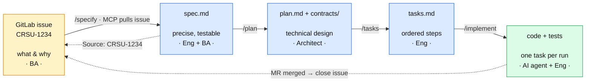
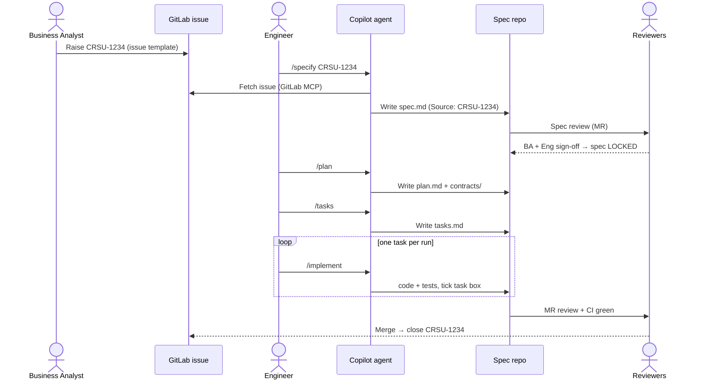

# The spec-driven workflow

Four stages, from a vague business requirement to merged code. Each stage has a clear
**owner**, a defined **input and output**, and a **gate** that must pass before the next
stage starts. Each artifact links back to the previous one for traceability.

### The pipeline

### The handoffs and review gates

## Stage 0 — Requirement (Business Analyst)
- **Input:** a business need.
- **Action:** raise a GitLab issue `CRSU-####` using `.gitlab/issue_templates/Requirement.md`.
- **Output:** an issue with goal, functional + non-functional requirements, and acceptance
  criteria — at a **business altitude**. The BA is not expected to know the code.
- **Gate:** issue triaged and labelled `~requirement`.

## Stage 1 — Specify (Engineering + BA)  → `spec.md`
- **Input:** the `CRSU-####` issue, plus `docs/constitution.md`, `docs/architecture.md`,
  `docs/domain-glossary.md`.
- **Action:** run `/specify CRSU-1234`. The agent fetches the issue (GitLab MCP), reads the
  project context, and distils a **precise, testable** `specs/CRSU-1234-<slug>/spec.md`:
  EARS requirements, concrete NFRs, Gherkin acceptance criteria, reason codes.
- **Output:** `spec.md` with header `Source: CRSU-1234`.
- **Gate (the important one):** spec review MR. **BA signs off** "captures intent";
  **engineering signs off** "precise and testable". Then the spec is **locked**.
  → See [why the issue itself is not this artifact](why-issues-are-not-specs.md).

## Stage 2 — Plan (Architect / Engineering)  → `plan.md`
- **Input:** the locked `spec.md`.
- **Action:** run `/plan`. Produces `plan.md` (components, data model, decisions as mini-ADRs,
  risks) and the API/event contract under `contracts/`.
- **Output:** `plan.md` + `contracts/`.
- **Gate:** design review. No code yet.

## Stage 3 — Tasks (Engineering)  → `tasks.md`
- **Input:** `plan.md`.
- **Action:** run `/tasks`. Produces an ordered checklist of small, individually verifiable
  tasks, each naming the files it touches and how it is verified.
- **Output:** `tasks.md`.
- **Gate:** quick sanity check that every acceptance criterion has a covering task.

> **Do we always need this stage?** `tasks.md` is the **control surface for the AI agent**, not
> paperwork for humans. Its value: each `/implement` run takes **one task**, so you get small,
> reviewable diffs, lower per-run context cost, and fewer hallucinations than asking the agent to
> build the whole plan at once. It also turns acceptance criteria into a verifiable checklist.
>
> **Scale it to the change:** for a substantial feature, keep `tasks.md` as its own artifact.
> For a trivial change (one endpoint, a config tweak), you may **fold the task list into a
> short section at the end of `plan.md`** and skip the separate file. What you should *not* skip
> is the principle of **small, individually-verified steps** — that's where the reliability and
> cost wins come from.

## Stage 4 — Implement (AI agent + Engineer)  → code + tests
- **Input:** `tasks.md`.
- **Action:** run `/implement` repeatedly — **one task per run**, each producing a small diff
  with passing tests, ticking the box in `tasks.md`.
- **Output:** working, tested code in a feature branch.
- **Gate:** MR review + CI green. Then **close `CRSU-1234`**.

## Definition of done for the whole chain
- `CRSU-1234` ↔ `spec.md` ↔ `plan.md` ↔ `tasks.md` ↔ MR all link to each other.
- Every Gherkin acceptance criterion in `spec.md` has a passing test.
- The issue is closed with a link to the merged MR.

A fully worked example of all four artifacts lives in
[`specs/CRSU-1234-refund-eligibility/`](../specs/CRSU-1234-refund-eligibility/).
