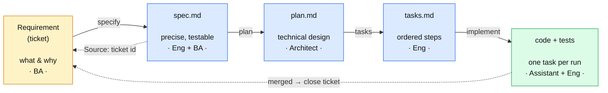

# Spec-Driven Development — Engineering Guidelines

> Our standard for building software with an AI coding assistant: how we go from a business
> requirement to merged code, **why** each step exists, **who owns** it, and **what it costs** in
> the assistant's context window.
>
> These guidelines are **tool- and language-agnostic**. Where we name a specific tool it is in an
> *"In our setup"* callout you can change without changing the method.

## What this is

**Spec-Driven Development (SDD)** means we write a precise, reviewed **specification** before the
AI assistant writes code, and treat that spec — not the original ticket, not a chat prompt — as
the source of truth the code is built against.

**The problem it solves.** An AI assistant is only as good as the context it is given. A vague
ticket forces the assistant to *guess* the missing detail — limits, states, error handling, edge
cases — and guesses are where defects and hallucinations come from. SDD removes the guessing by
making the requirement **exact and testable before** any code is generated.

**What good looks like.**
- Every change traces from a business requirement → a reviewed spec → a plan → code → a merge.
- The assistant works from small, precise, version-controlled artifacts, not from memory or chat.
- A reviewer can answer "why is the code like this?" by reading the spec, not by interrogating the
  author.

**When to apply it.** Any change with real behaviour or risk. A one-line typo fix does not need a
spec; a new endpoint, a rule change, or anything customer- or money-facing does.

> **In our setup:** the AI assistant is **GitHub Copilot**; requirements are raised as `CRSU-####`
> issues/tasks in **GAT (GitLab Agile Tool)**; and the assistant can read those issues
> via a **GitLab MCP** server.

## The pipeline

## Contents

| Page | What it covers |
|---|---|
| [Principles](principles) | The five ideas everything rests on |
| [Roles & ownership](roles-and-ownership) | RACI — who owns each step |
| [The workflow](workflow) | The five stages, each with owner / why / optional / cost |
| [Why the ticket is not the spec](why-ticket-is-not-spec) | The reasoning behind committing a spec |
| [Repository layout](repository-layout) | Where specs live and the naming conventions |
| [Assistant config (.github)](assistant-config) | The harness files and why they're shaped that way |
| [Context & cost model](context-and-cost) | What the assistant reads, and how to keep it cheap |
| [Quality gates & DoD](quality-gates) | The human checkpoints and Definition of Done |
| [Governance & audit](governance) | Traceability, immutability, separation of duties |
| [Adoption checklist](adoption-checklist) | How a team starts |
| [FAQ](faq) | Common questions |
| [Glossary](glossary) | Shared vocabulary |
