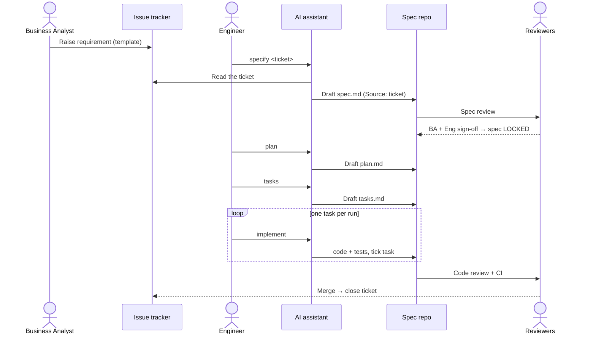

_[← Guidelines home](home)_

# The workflow

Five stages, each described with the **same template** so you always find the owner, the rationale,
the optionality, and the cost in the same place. The pipeline overview is on the
[home page](home#the-pipeline); the handoffs and review gates are below.

## Handoffs & review gates

## The per-stage template

Each stage uses these fields: **Purpose · Why it exists · Owner · Inputs · Output · Quality gate ·
Optional? · Prompt cost.**

---

### Stage 0 — Requirement
- **Purpose:** capture the business need as a tracked issue / task.
- **Why it exists:** gives every change a single referenceable origin and an audit anchor, and
  separates the *what/why* (business) from the *how* (engineering).
- **Owner:** Business Analyst (or the requesting user).
- **Inputs:** a business need.
- **Output:** an issue written at **business altitude** — goal, functional and non-functional
  needs, acceptance criteria — created from the **requirement template**. The template prompts the
  BA or user to provide as much information as possible up front. They are **not** expected to know
  the code.
- **Quality gate:** triaged, labelled, and has at least a goal and acceptance criteria.
- **Optional?** No. Every change traces to an issue.
- **Prompt cost:** none yet (no AI). Keep the issue **structured** (via the template) so later
  ingestion is cheap.

> **In our setup:** the requirement is raised as an **issue/task in GAT (GitLab Agile Tool)**,
> keyed `CRSU-####`. A shared **requirement template** in GAT guides the BA or requesting
> user to capture goal, functional and non-functional needs, and acceptance criteria, so as much
> detail as possible arrives with the issue. It is fine for this to be vague on technical detail —
> the **Specify** stage (next) fills that in.

### Stage 1 — Specify → `spec.md`
- **Purpose:** turn the vague ticket into a **precise, testable** specification.
- **Why it exists:** the gap between business intent and code must be filled with engineering
  knowledge (architecture, domain rules, error model). *Filling that gap is the spec.* Point the
  assistant at the raw ticket instead and it fills the gap by guessing.
- **Owner:** Engineer (Responsible), Tech Lead (Accountable), BA (approves intent).
- **Inputs:** the ticket **plus** project context — principles, architecture notes, domain glossary.
- **Output:** `spec.md` with a `Source: <ticket-id>` header, requirements in **EARS** form,
  concrete NFRs, and **Gherkin** acceptance criteria (which become the tests).
- **Quality gate:** spec review. **BA signs off** "captures intent"; **engineering signs off**
  "precise and testable". The spec is then **locked**.
- **Optional?** No — this is the heart of SDD.
- **Prompt cost:** *medium.* Reads the ticket (once) and project context. Pull the ticket here,
  distil it, and commit the result so later stages never re-read the noisy ticket.

### Stage 2 — Plan → `plan.md`
- **Purpose:** the technical design derived from the locked spec.
- **Why it exists:** separates *design decisions* from *mechanical coding*, and creates a review
  point **before** code exists. Records contestable choices as short decision notes (ADRs).
- **Owner:** Tech Lead / Architect.
- **Inputs:** the locked `spec.md` + architecture context.
- **Output:** `plan.md` (components, data model, decisions, risks) and any interface contracts.
- **Quality gate:** design review. No code yet.
- **Optional?** Can be **folded into the spec** for a very small change — but the *decisions* must
  be recorded somewhere reviewable.
- **Prompt cost:** *medium.* Reads the spec + architecture. It does **not** need the raw ticket —
  that is the payoff of having distilled it in Stage 1.

### Stage 3 — Tasks → `tasks.md`
- **Purpose:** break the plan into small, ordered, individually verifiable steps.
- **Why it exists:** this is the **control surface for the assistant**. One task per run yields
  small, reviewable diffs, lower per-run context cost, and fewer hallucinations than asking it to
  build the whole plan. It also turns acceptance criteria into a coverage checklist.
- **Owner:** Engineer.
- **Inputs:** `plan.md`.
- **Output:** `tasks.md` — an ordered checklist; each task names the files it touches and how it is
  verified.
- **Quality gate:** every acceptance criterion in the spec maps to at least one task.
- **Optional?** **Yes, for trivial changes** — fold the task list into the end of `plan.md`. What
  you must **never** drop is the *principle* of small, individually-verified steps.
- **Prompt cost:** *low.* Reads the plan only.

### Stage 4 — Implement → code + tests
- **Purpose:** produce working, tested code.
- **Why it exists:** turning a verified task list into code is the part the assistant does best —
  **one task per run** keeps each diff small and reviewable.
- **Owner:** AI assistant (Responsible) under an Engineer (Accountable).
- **Inputs:** `tasks.md` + the relevant code + the scoped coding rules (see [assistant config](assistant-config)).
- **Output:** code and tests; each completed task is ticked off.
- **Quality gate:** code review + CI green. Then **close the ticket**.
- **Optional?** No.
- **Prompt cost:** *lowest per run by design.* Attach only `tasks.md` and the files in play —
  **not** the whole spec history. This is the single biggest cost lever in the whole flow.
